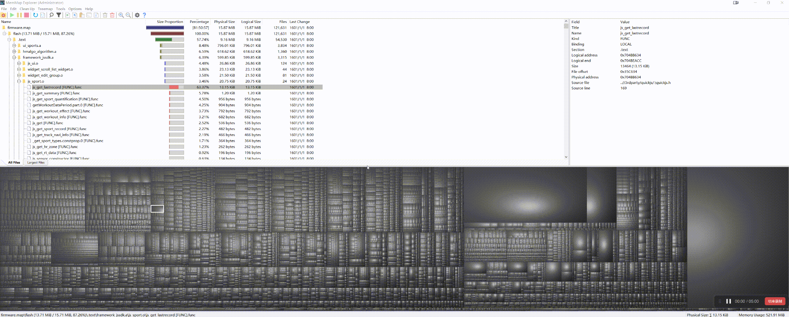
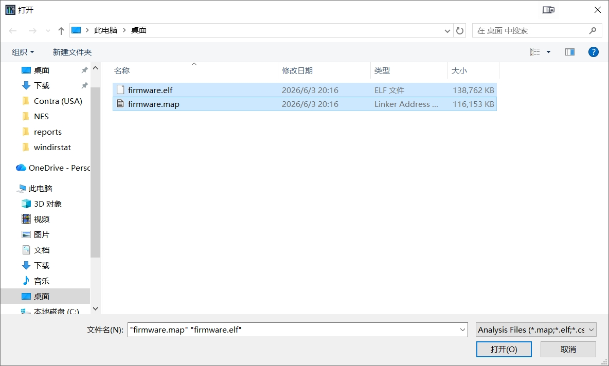
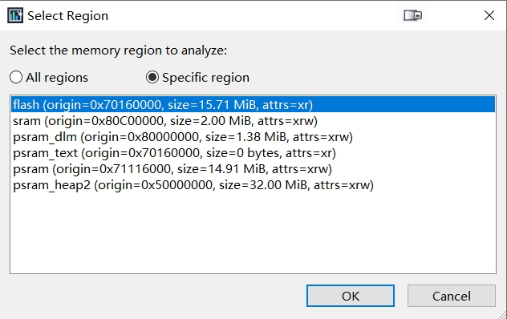
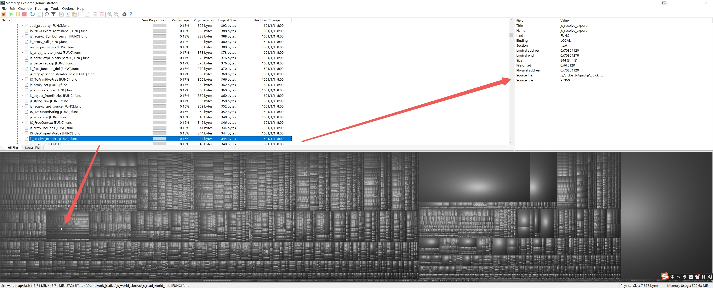
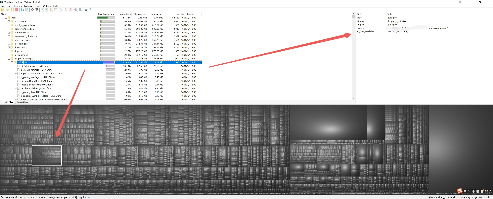

# MemMap Explorer

**WinDirStat-style treemap UI + MAP/ELF symbol and memory layout analysis for Windows.**

If this project helps you, please consider giving it a **Star**.

[Download](https://github.com/Zepp-Hanzj/MemMapExplorer/releases) · [Screenshots](#screenshots) · [中文](#中文) · [English](#english)

[English](#english) | [中文](#中文)

---

## Why MemMap Explorer?

- Familiar **WinDirStat-style** tree + treemap workflow
- Built for **MAP / ELF import** and binary memory-layout analysis
- Inspect **regions, sections, objects, and symbols** in one UI
- Show structured metadata and **DWARF source line** details when available
- Useful for **embedded**, **firmware**, **reverse-engineering**, and **binary size** analysis

## Quick comparison

| Feature | WinDirStat | MemMap Explorer |
| --- | ---: | ---: |
| Tree / treemap workflow | ✅ | ✅ |
| MAP import | ❌ | ✅ |
| ELF parsing | ❌ | ✅ |
| Region / section / symbol details | ❌ | ✅ |
| DWARF line mapping | ❌ | ✅ |
| Imported analysis details pane | ❌ | ✅ |

## 中文

MemMap Explorer 是一个 Windows 桌面应用，专注于分析 linker MAP 文件、ELF 二进制以及已保存分析结果中的 **内存布局、区域、Section、Object 与 Symbol 数据**。

本仓库是基于 [WinDirStat](https://github.com/windirstat/windirstat) 修改而来的**衍生项目**。它保留了 WinDirStat 经典的目录树与 Treemap 交互方式，同时扩展到了内存区域、Section、Object、Symbol 以及导入分析数据等场景。

### 软件作用

MemMap Explorer 适合用于可视化分析大型二进制与链接结果数据，主要用途包括：

- 导入并查看 MAP / ELF 分析结果
- 浏览 memory region、section、object、symbol
- 在右侧详情面板查看结构化元数据
- 在可用时关联地址、大小、属性和源码行信息
- 导出并重新打开分析结果

### 为什么值得关注

- 如果你喜欢 WinDirStat 的交互方式，但又需要分析 **MAP / ELF / 符号 / 内存区域**，这个项目更合适
- 如果你在做 **嵌入式固件、链接产物、二进制体积分析、逆向定位**，这个项目更直接
- 如果这个项目对你有帮助，欢迎点一个 **Star**

### 主要特性

- 保留 WinDirStat 风格的导航与 Treemap 可视化
- 品牌升级为 **MemMap Explorer**
- 支持 MAP / ELF 导入分析流程
- 提供 region、section、object、symbol 的详细信息
- 支持 DWARF `.debug_line` 解析
- 支持导入内存数据时的区域选择
- 改进右侧详情面板以展示导入节点信息
- 修复 Top Files 视图中的悬空指针稳定性问题

### 截图

#### 动图预览

#### 界面截图

### 项目来源与致谢

本项目基于开源项目 **WinDirStat** 修改而来。

- 上游仓库：<https://github.com/windirstat/windirstat>
- 原始交互模型和项目基础：WinDirStat 及其贡献者
- 当前仓库在此基础上增加了内存映射分析、导入分析、界面增强和品牌重命名等工作

感谢 WinDirStat 维护者和贡献者提供了优秀的开源基础，使本衍生项目成为可能。

更完整的说明请见 [ACKNOWLEDGEMENTS.md](ACKNOWLEDGEMENTS.md)。

### 许可证

本项目采用 **GPL-2.0-or-later** 发布。

原因：

- 当前仓库包含基于 WinDirStat 修改而来的源码
- 现有源码头部声明为：`either version 2 of the License, or (at your option) any later version`
- 因此该衍生项目在分发时应继续遵守 GPL 兼容条款

完整许可证文本见 [LICENSE](LICENSE)。

### 构建方式

#### 环境要求

- Windows
- Visual Studio（Desktop C++ workload）
- MFC / ATL 支持
- Windows SDK

#### 构建步骤

1. 用 Visual Studio 打开 `windirstat/windirstat.vcxproj`
2. 选择 `Release | x64` 或其他目标配置
3. 执行生成
4. 输出主程序为 `MemMapExplorer.exe`

### Release 打包建议

建议在 GitHub Release 中发布：

- `MemMapExplorer.exe` 或便携版 ZIP
- GitHub 自动生成的源码包
- [RELEASE_NOTES_v2.6.2.md](RELEASE_NOTES_v2.6.2.md) 作为发布说明

---

## English

MemMap Explorer is a Windows desktop application focused on analyzing **memory layouts, regions, sections, objects, and symbols** from linker MAP files, ELF binaries, and saved analysis results.

This repository is a **modified derivative of [WinDirStat](https://github.com/windirstat/windirstat)**. It preserves the familiar tree and treemap workflow from WinDirStat while extending the project toward memory maps, regions, sections, objects, symbols, and imported-analysis scenarios.

### What it does

MemMap Explorer helps you inspect and navigate large binary and linker-analysis datasets visually.

It can be used to:

- import and inspect MAP- and ELF-based analysis data
- browse memory regions, sections, objects, and symbols
- inspect symbol metadata in a structured details pane
- correlate imported nodes with addresses, sizes, attributes, and source lines when available
- export and reopen collected results in supported formats

### Why it may be worth a Star

- It keeps the familiar WinDirStat interaction model while extending it to **MAP / ELF / symbol / memory-region** analysis
- It is useful for **embedded**, **firmware**, **binary size**, and **reverse-engineering** workflows
- If it saves you time, please consider giving the repository a **Star**

### Main features

- WinDirStat-style navigation and treemap visualization
- product rebrand to **MemMap Explorer**
- MAP/ELF import pipeline for non-filesystem analysis
- detailed per-node metadata for regions, sections, objects, and symbols
- DWARF `.debug_line` parsing for richer source mapping
- region selection workflow for imported memory data
- improved right-side details pane for imported analysis
- stability fixes, including stale-pointer cleanup in the largest-files view

### Screenshots

#### Animated preview

#### UI previews

### Attribution and upstream project

This project is based on the open-source **WinDirStat** project.

- Upstream repository: <https://github.com/windirstat/windirstat>
- Original UI workflow and project foundation: WinDirStat and its contributors
- This repository contains additional work for memory-map exploration, imported analysis, UI enhancements, and branding changes

Thank you to the WinDirStat maintainers and contributors for the original project and for making derivative work possible under the project license.

A fuller note is available in [ACKNOWLEDGEMENTS.md](ACKNOWLEDGEMENTS.md).

### License

This project is distributed under **GPL-2.0-or-later**.

Reason:

- the repository contains source code derived from WinDirStat
- existing source headers in this codebase state: `either version 2 of the License, or (at your option) any later version`
- derivative redistribution should therefore remain under GPL-compatible terms

See [LICENSE](LICENSE) for the full license text.

### Building

#### Requirements

- Windows
- Visual Studio with Desktop C++ workload
- MFC/ATL support
- Windows SDK

#### Build steps

1. Open `windirstat/windirstat.vcxproj` in Visual Studio.
2. Select `Release | x64` or another desired configuration.
3. Build the project.
4. The main output executable is `MemMapExplorer.exe`.

### Release packaging suggestion

For GitHub Releases, publish:

- `MemMapExplorer.exe` or a portable ZIP package
- source archives generated by GitHub
- [RELEASE_NOTES_v2.6.2.md](RELEASE_NOTES_v2.6.2.md) as the release notes
